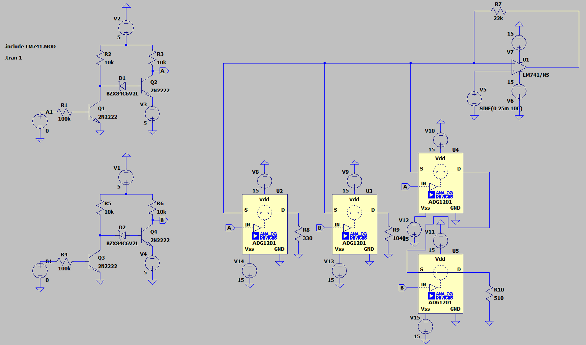
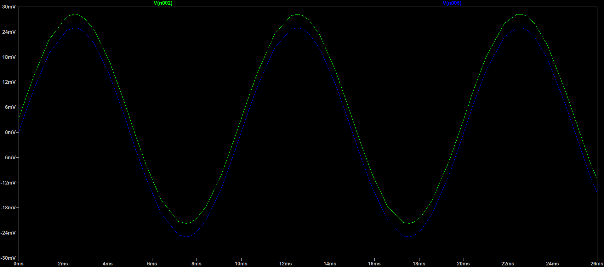
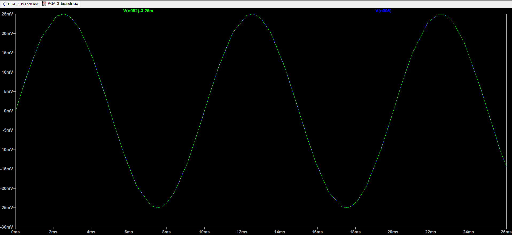
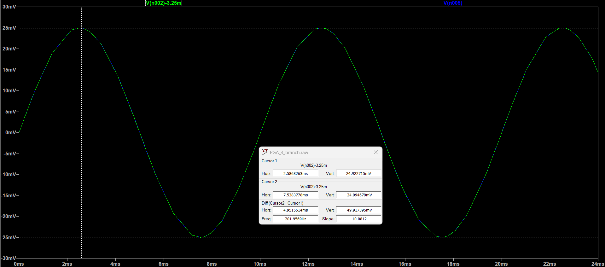
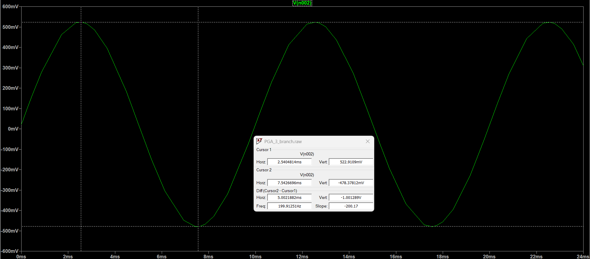
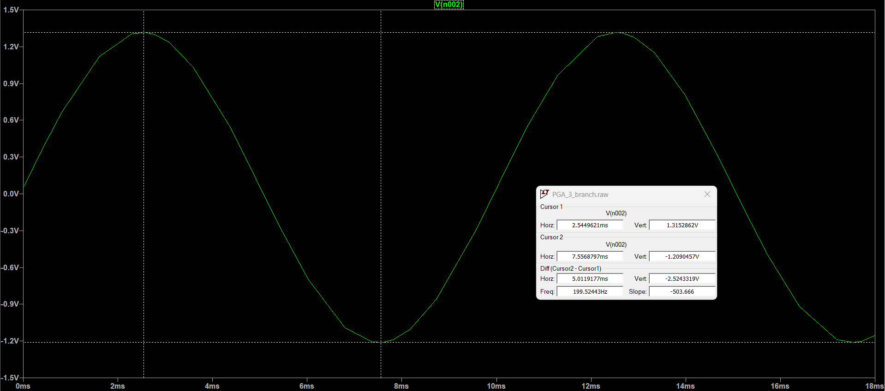
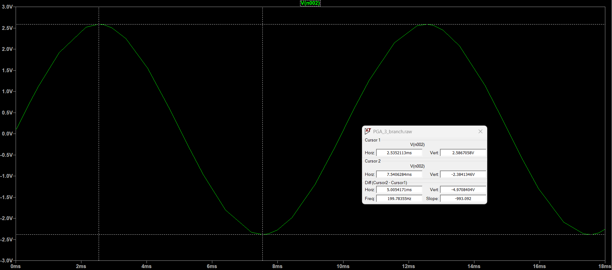

# Discrete Programmable Gain Amplifier (PGA) with Dynamic Hardware Trimming

A hardware implementation of a discrete Programmable Gain Amplifier (PGA) utilizing ADG1201 analog switches and BJT-based level shifters. This project features a custom parallel-branch architectural modification to achieve highly precise gain states (1x, 20x, 50x, 100x) while mitigating the inherent non-idealities of analog silicon.

## System Architecture

The circuit bridges two distinct power domains and logic families to achieve programmable analog amplification:

* **The Amplifier Domain ($\pm15$V):** Built around the LM741 operational amplifier, utilizing high-headroom dual rails to prevent signal clipping during the 100x gain state.
* **The Switch & Logic Domain ($\pm5$V):** The ADG1201 precision analog switches require a bipolar supply to pass the AC sine wave without clipping the negative cycle. 
* **BJT Level Shifters:** Because standard microcontrollers output 0V to 5V TTL logic, a custom level-shifter circuit using 2N2222 BJTs and 6.2V Zener diodes was implemented. This successfully translates the unipolar 0-5V digital control signal into the bipolar $+5$V to $-5$V logic required to aggressively toggle the analog switches.

## The Engineering Challenge: The '11' State (100x Gain)

In a standard theoretical PGA topology, achieving maximum gain (100x) involves closing multiple feedback branches in parallel. However, in physical hardware, the inherent ON-resistance ($R_{ON}$) of the ADG1201 CMOS switches introduces dynamic series resistance that scales non-linearly, causing severe gain deviation in the '11' logic state.

**The Solution:** Rather than simply increasing the global feedback resistance (which would exponentially increase the thermal noise floor and introduce parasitic low-pass filtering), a structural modification was applied. A dedicated third parallel branch was routed via an analog AND-gate configuration (Switch A wired in series with Switch B). This allows the 100x state to be manually trimmed independently of the 20x and 50x branches, maintaining high bandwidth and a low signal-to-noise ratio.

## Mitigating BJT Input Bias (DC Offset)

The LM741 utilizes older BJT technology at its input stage, which draws a physical bias current (in the nanoamp range). Because the PGA constantly changes its source resistance ($R_{in}$) as it switches between gain states, this bias current creates a fluctuating DC voltage drop, shifting the output waveform off the 0V center axis. 

During physical bench testing, this was mitigated by AC-coupling the oscilloscope channels. To perfectly mirror this physical bench-test condition in the LTSpice software validation, trace-level mathematics (`V(out) - V(offset)`) were applied directly in the waveform viewer to extract the pure AC transient response.

| Raw Output (Demonstrating BJT DC Offset) | Corrected Output (Trace Math Applied) |
| :---: | :---: |
|  |  |

## Performance Data

The circuit was stimulated with a 1 kHz, 25 mV peak unipolar sine wave to test the logic routing and amplification linearity. 

| Logic State (A B) | Target Gain | Input Amplitude | Theoretical Output | LTSpice Measured Output |
| :---: | :---: | :---: | :---: | :---: |
| **00** | 1x | 25 mV | 25 mV | 24.9 mV |
| **01** | 20x | 25 mV | 500 mV | 522.9 mV |
| **10** | 50x | 25 mV | 1.25 V | 1.31 V |
| **11** | 100x | 25 mV | 2.50 V | 2.59 V |

*Note: Minor gain deviations at higher multipliers reflect the real-world physical modeling of resistor tolerances and switch $R_{ON}$ variations in the SPICE environment.*

### Transient Gain Step Verification

| 1x Gain (State 00) | 20x Gain (State 01) |
| :---: | :---: |
|  |  |

| 50x Gain (State 10) | 100x Gain (State 11) |
| :---: | :---: |
|  |  |

## Running the Simulation

All simulation files are located in the `Simulation_Files/` directory.
1. Ensure you have LTSpice installed.
2. Clone this repository and navigate to `Simulation_Files/`.
3. Open `PGA_Modified_3Branch.asc`.
4. **Critical:** Ensure `lm741.mod` remains in the exact same directory as the `.asc` file, as the schematic utilizes a `.include` directive to pull the physical component parameters.
5. Run the `.tran 1` simulation and probe node `V(n005)` to view the output.